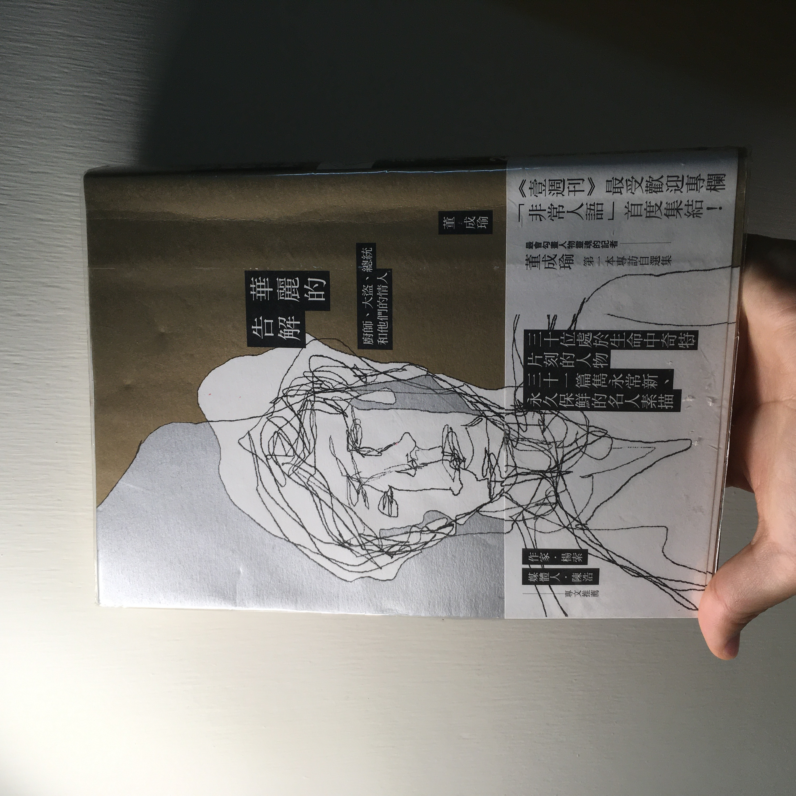

- 作者：董成瑜
- 出版時間：2016-01-29
- 出版社：時報出版
- Score：<code>:sparkles::sparkles::sparkles::sparkles:</code>

因為上學期的國文課而知道了這本書，作者董成瑜，擅長人物專訪。

課堂開始，先閱讀了書內自序—進入他人內心之必要，敘述採訪者跟每個受訪者的、想像的，近似短期戀愛的關係，在這種接近愛上、迷戀對方的狀態下，一舉一動都將被放大檢視，但這樣的迷戀是有時效性的，是作者讓自己「被浸泡」在那樣的狀態下，更容易抽離。

問問題的人似乎需要對問題和框架、背景有清楚的認知，那麼，採訪者可能會比受訪者更了解他們自己嗎？也許能做到的只有一層一層抽絲剝繭，僅僅只是了解人物背景，並不足以完成一篇人物專訪，畢竟，人無時無刻都在變化。

或者需要回到最基本的信任問題，身為採訪者，該如何在幾次的會面中讓受訪對象「做自己」？就像書裡描述的，通常採訪者都需要先舉雙手投降，讓受訪者知道自己並沒有加害於他的目的，專訪才可能順利進行，也許是知曉媒體的力量，明白經過裁剪之後的語句，可能讓自己處在危險的環境下，也可能什麼事都沒發生，就算來者釋出善意，一般人還是會有所保留，那麼看穿這種「保留」的能力，也許就是訪問者的課題了。

而關於真的想要了解的問題，是什麼樣的過去，造就了眼前的這個人？也許這本書存在的目的就是驗證與紀錄，集合了政客、黑道老大、廚師等等不同背景的人們，經過時間的驗證，我們可以看見歷史的軌跡如何運行，也可以透過作者對人物的細膩側寫，看見那些大眾媒體和網路平台上，名人們的不同面貌。
